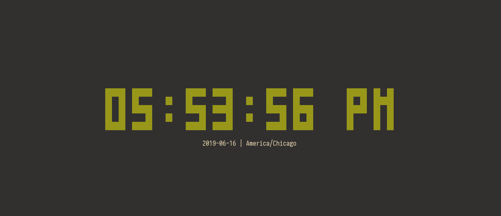

# tock

A digital clock for the terminal, inspired by [tty-clock][0].
Unfortunately only works on UNIX systems due to the use of
the `termios` and `sigaction` related function calls.

Note: emulating all features of tty-clock is **not** a goal of this project.

## Features

- Efficient bitmap and diff-based drawing
- Timezone support via the `TZ` environment variable and `tzselect` utility
- Military time and second display toggling
- Color customization using ANSI, 8-bit, or 24-bit color values
- Positioned or centered clock
- Adjustable display size
- Synchronization with system clock seconds

## Screenshots




## Installation

Currently requires a Rust installation, and is only available from either:

1. [crates.io][1]

```
$ cargo install tock
```

2. Building from source

```
$ git clone https://github.com/nwtnni/tock.git
$ cargo build --release
$ ./target/release/tock
```

## Usage

```
USAGE:
    tock [FLAGS] [OPTIONS]

FLAGS:
    -c, --center
            Center the clock in the terminal. Overrides manual positioning.

        --help
            Prints help information

    -m, --military
            Display military (24-hour) time.

    -s, --seconds
            Display seconds.

    -V, --version
            Prints version information


OPTIONS:
    -C, --color <color>
            Change the color of the time.

            Accepts either a [single 8-bit number][0] or three comma-separated 
            8-bit numbers in R,G,B format. Does not check if your terminal 
            supports the entire range of 8-bit or 24-bit colors.

            [0]: https://en.wikipedia.org/wiki/ANSI_escape_code#8-bit [default: 2]

    -h, --height <h>
            Font height in characters per tile. [default: 1]

    -w, --width <w>
            Font width in characters per tile. [default: 2]

    -x, --x <x>
            Horizontal 0-indexed position of top-left corner. [default: 1]

    -y, --y <y>
            Vertical 0-indexed position of top-left corner. [default: 1]
```

## References

- [How Not to Write a Signal Handler][2]
- [What is the difference between sigaction and signal?][3]
- [A Brief Introduction to termios: termios(3) and stty][4]
- [Understanding UNIX termios VMIN and VTIME][5]
- [Specifying the Time Zone with TZ][6]
- [min-sized-rust][7]

[0]: https://github.com/xorg62/tty-clock
[1]: https://crates.io/
[2]: http://lazarenko.me/signal-handler/
[3]: https://stackoverflow.com/questions/231912/what-is-the-difference-between-sigaction-and-signal
[4]: https://blog.nelhage.com/2009/12/a-brief-introduction-to-termios-termios3-and-stty/
[5]: http://www.unixwiz.net/techtips/termios-vmin-vtime.html
[6]: https://www.gnu.org/software/libc/manual/html_node/TZ-Variable.html
[7]: https://github.com/johnthagen/min-sized-rust
