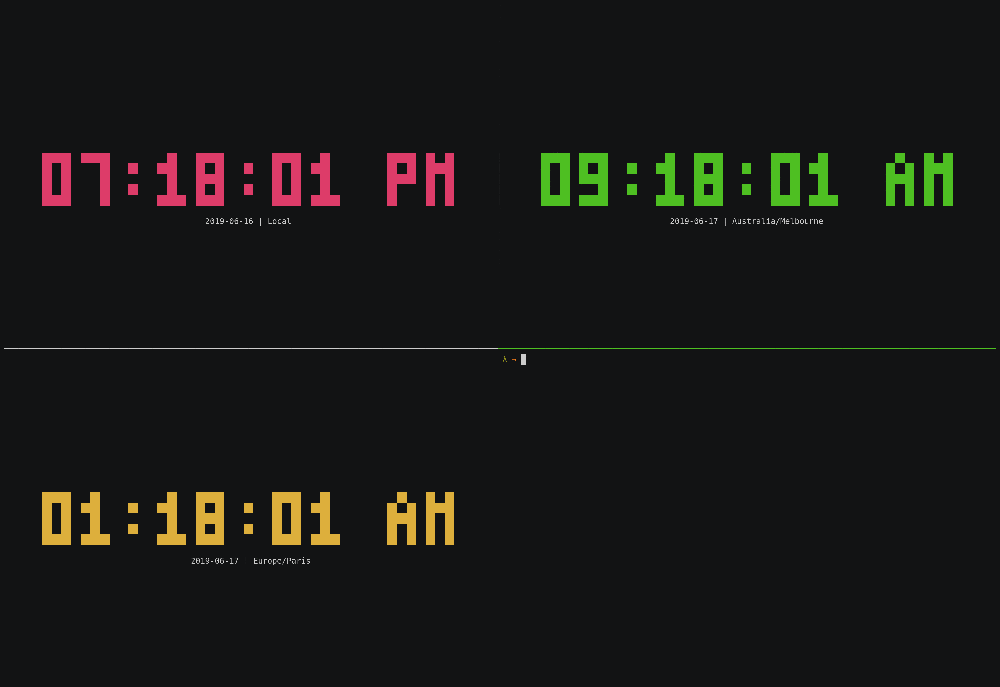

# tock

A digital clock for the terminal, inspired by [tty-clock][0].
Unfortunately only works on UNIX systems due to the use of
the `termios` and `sigaction` related function calls.

Note: emulating all features of tty-clock is **not** a goal of this project.

## Features

- Efficient bitmap and diff-based drawing
- Timezone support via the `TZ` environment variable and `tzselect` utility
- Military time and second display toggling
- Color customization using ANSI, 8-bit, or 24-bit color values
- Arbitrary date formatting
- Positioned or centered clock
- Adjustable display size
- Synchronization with system clock seconds
- Minimal syscalls (about one `read`, `write`, `nanosleep` per second)

## Screenshots




## Installation

Currently requires a Rust installation with version >= 1.70.0
(due to the [`IsTerminal`](https://doc.rust-lang.org/stable/std/io/trait.IsTerminal.html) trait,
and is only available from either:

1. [crates.io][1] using [`cargo-install`](https://doc.rust-lang.org/cargo/commands/cargo-install.html)

```sh
cargo install tock
```

2. Building from source

```sh
git clone https://github.com/nwtnni/tock.git
cargo build --release
./target/release/tock
```

## Usage

```output
A digital clock for the terminal.

Usage: tock [OPTIONS]

Options:
  -x, --x <X>            Horizontal 0-indexed position of top-left corner [default: 0]
  -y, --y <Y>            Vertical 0-indexed position of top-left corner [default: 0]
  -W, --width <WIDTH>    Font width in characters per tile [default: 2]
  -H, --height <HEIGHT>  Font height in characters per tile [default: 1]
  -s, --second           Display seconds
  -m, --military         Display military (24-hour) time
  -c, --center           Center the clock in the terminal. Overrides manual positioning
  -C, --color <COLOR>    Change the color of the time [default: 2]
  -f, --format <FORMAT>  Change the date format [default: "%F | %Z"]
  -h, --help             Print help (see more with '--help')
```

Currently compiles with the `interactive` feature flag set by default, which
polls `stdin` for user input once per second. Available commands with this
feature flag set are:

- `q` or `Q` or `<ESC>`: Exit.
- `s`: Toggle second display.
- `m`: Toggle military (24H) time.
- `0`..=`7`: Change to corresponding ANSI color.

## References

- [How Not to Write a Signal Handler][2]
- [What is the difference between sigaction and signal?][3]
- [A Brief Introduction to termios: termios(3) and stty][4]
- [Understanding UNIX termios VMIN and VTIME][5]
- [Specifying the Time Zone with TZ][6]
- [min-sized-rust][7]

[0]: https://github.com/xorg62/tty-clock
[1]: https://crates.io/
[2]: http://lazarenko.me/signal-handler/
[3]: https://stackoverflow.com/questions/231912/what-is-the-difference-between-sigaction-and-signal
[4]: https://blog.nelhage.com/2009/12/a-brief-introduction-to-termios-termios3-and-stty/
[5]: http://www.unixwiz.net/techtips/termios-vmin-vtime.html
[6]: https://www.gnu.org/software/libc/manual/html_node/TZ-Variable.html
[7]: https://github.com/johnthagen/min-sized-rust
[8]: https://github.com/Canop
